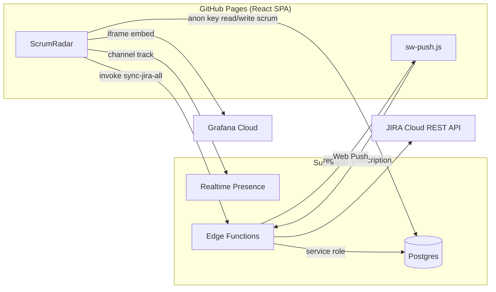

# ScrumRadar — 개발자 인수인계 가이드

**FASS 데일리 스크럼 웹 애플리케이션(ScrumRadar)** 의 프론트엔드·백엔드·배포·운영을 후임 개발자가 이 문서만으로 파악할 수 있도록 정리한 인수인계 문서입니다.

| 항목 | 내용 |
|------|------|
| **프로덕션 URL** | https://kk00701903-hub.github.io/fass-dailyscrum/ |
| **FE** | React 18 + TypeScript + Vite 5 + Tailwind CSS 4 + shadcn/ui + Zustand |
| **라우팅** | `HashRouter` (GitHub Pages SPA 호환) |
| **호스팅** | GitHub Pages (`gh-pages` 브랜치) |
| **백엔드 & DB** | Supabase (Postgres, RPC, Realtime Presence, Edge Functions) |
| **주요 연동** | JIRA Cloud REST API, Grafana Cloud 대시보드 iframe 임베드 |
| **최근 배포 커밋** | `1차 수정` (`master` → GitHub Pages 자동 배포) |

---

## 변경 이력 — 1차 수정

> 커밋 메시지 **「1차 수정」** 에 포함된 주요 기능·UI·데이터·운영 변경 요약입니다.  
> 프로덕션: https://kk00701903-hub.github.io/fass-dailyscrum/

### 인증·접근

| 항목 | 내용 |
|------|------|
| 커스텀 로그인 | Supabase Auth 대신 `app_users` + RPC (`login_app_user`, `register_app_user`) |
| 화면 | 로그인·회원가입·아이디 찾기·비밀번호 찾기 (`/login`, `/signup`, …) |
| 보호 라우트 | `ProtectedRoute` — 미로그인 시 로그인으로 이동 |
| 세션 | `authStore` + localStorage (이 기기 기준) |

### 데일리 스크럼

| 항목 | 내용 |
|------|------|
| 담당자 | **서선범(`seo`) 제외** — `DAILY_SCRUM_MEMBERS` 기준 |
| 백로그 | 담당자별 **등록 스프린트** 트리(펼치면 태스크 선택). 등록 없으면 **전체 스프린트**에서 선택 |
| 담당 이슈 필터 | 상태 토글: 진행 중 / 할 일 / 검토 중 / 블로커 / 완료 — **기본값: 진행 중만** |
| 이슈 선택 | `ScrumTaskPicker` — 할 일(TODO) 선택 시 JIRA 진행 중 변경 안내 |
| 저장 | 진행 중 담당 이슈가 있으면 **1건 이상 선택 필수** + 전일·오늘 입력 검증 |
| 스프린트 | 메인 스프린트 UI 제거 → 멤버별 **필터·포커스 스프린트** (`scrum-sprint-preferences`) |
| 데이터 | 목업 제거 — **JIRA 동기화 + Supabase + localStorage** 만 사용 |

### 팀 일지·설정

| 항목 | 내용 |
|------|------|
| 팀 전체 일지 | `TeamDailyLogGrid` — CSS Grid로 헤더·본문 **컬럼 수직 정렬** (가상 스크롤 유지) |
| 담당자 설정 | `TeamCompositionSettings` — 실시간 로그인 RPC·스피너 제거, 비밀번호 초기화는 `member_id` 기준 |
| 팀 구성 표시 | `team_member_display_settings` — 스크럼 일지·애널리틱스 포함 여부 |

### JIRA 연동·동기화

| 항목 | 내용 |
|------|------|
| 데이터 소스 | 샘플/목업(`mockTasks` 등) **전부 제거** — JIRA·Supabase 캐시만 표시 |
| 스프린트 동기화 | **전체 삭제 후 재삽입** (이름 변경 시 구 데이터 잔류 방지) |
| 이슈 upsert | `jira_issue_id` 기준 upsert |
| 인증 | `jira-basic-auth.ts` — UTF-8 Base64·따옴표 trim 통합 |
| 환경 변수 | 브라우저: `VITE_JIRA_*` / Edge·CLI: `JIRA_API_TOKEN` 등 분리 |
| 로컬 진단 | `npm run test:jira`, `scripts/jira-auth-diagnose.mjs` |
| 동기화 UI | JIRA 동기화 페이지 — 스프린트 DB 대시보드 중심 (이슈 테이블·연동 테스트 패널 제거) |

### JIRA WBS (`/jira/wbs`)

| 항목 | 내용 |
|------|------|
| UI | `gantt-task-react` 기반 **좌측 메타 테이블 + 우측 Gantt** (`JiraWbsGanttView`) |
| 타임라인 | **2027년 12월 말**까지 스크롤 (`wbsGanttTimelineEndDate`) |
| 헤더 | 월·주차 커스텀 오버레이, 프로젝트 마일스톤 띠(프로토타입 스타트, Live, 종료) |
| 스크롤 | 좌·우 **세로 동기화**, 하단·타임라인 **가로 동기화** 훅 |
| 레이아웃 | 좌·우 패널 **세로 분할선**, 스프린트/태스크 열 **좌측 정렬 + depth 들여쓰기** |
| 간트 라벨 | **접힌 스프린트**: 막대 안 `[S14]` 코드만 / **펼침·태스크**: 우측 간트 텍스트 **비표시** (좌측 테이블만) |
| 필터 | 스프린트 상태·담당자 멀티 필터, 진행 중 스프린트 일괄 펼치기/접기 |

### JIRA 의존성·애널리틱스

| 항목 | 내용 |
|------|------|
| 의존성 맵 | `/jira/dependencies` — `jira_dependencies` 기반 시각화 |
| 애널리틱스 | JIRA 실데이터 집계만 사용 (`jira-live-data.ts`), 샘플 차트·`analytics-fallback` 제거 |
| Grafana | 애널리틱스 iframe 임베드 유지, **Grafana 연동 메뉴 페이지**는 제거 |

### 실시간·알림

| 항목 | 내용 |
|------|------|
| Presence | Supabase Realtime `online-users` — 팀원 온라인 표시 |
| 웹 푸시 | `sw-push.js`, 구독·알림 설정, 스크럼 미입력 리마인더 Edge Function |

### DB·마이그레이션 (신규·주요)

| 파일 | 내용 |
|------|------|
| `20260522120000_jira_sprints_schedule.sql` | 스프린트 일정 컬럼 |
| `20260523120000_jira_dependencies.sql` | 이슈 의존성 |
| `20260526120000_scrum_member_sprints.sql` | 담당자별 등록 스프린트 |
| `20260527120000_app_users_auth.sql` | 앱 사용자·로그인 RPC |
| `20260529120000_web_push_notifications.sql` | 웹 푸시·알림 |
| `20260531130000_team_member_display_settings.sql` | 팀원 표시 설정 |

### 운영·스크립트

| 명령 | 설명 |
|------|------|
| `npm run clear:test-data` | Supabase 스크럼·일지 테스트 데이터 삭제 (JIRA 캐시 유지) |
| `npm run test:interface` | **오프라인 통합 93건** — 데일리 스크럼·WBS·저장·상태 필터·Excel 내보내기 |
| `npm run test:interface:live` | JIRA REST 실연동 (유효 `.env.local` 필요) |
| `npm run verify:interface` | Supabase ↔ 앱 ↔ JIRA 3-way 검증 |
| `npm run test:interface:all` | 위 명령 일괄 실행 |
| `npm run verify:fwk` | FWK 담당 이슈·인터페이스 검증 |

상세: [`docs/INTERFACE_TEST.md`](docs/INTERFACE_TEST.md)

### 제거·비권장

- 대시보드 페이지(`Dashboard.tsx`)·목업 데이터 파일
- Slack 임계값 알림 연동
- Grafana 전용 가이드 **페이지** (임베드는 애널리틱스에 유지)
- JIRA 동기화 화면의 이슈 테이블·Exporter·연동 테스트 패널

---

## 목차

1. [변경 이력 — 1차 수정](#변경-이력--1차-수정)
2. [빠른 시작 (Getting Started)](#1--빠른-시작-getting-started)
3. [시스템 아키텍처 및 데이터 흐름](#2-️-시스템-아키텍처-및-데이터-흐름-architecture--data-flow)
4. [데이터베이스 및 백엔드 핵심 오브젝트](#3-️-데이터베이스-및-백엔드-핵심-오브젝트-supabase-setup)
5. [서비스 워커 및 배포 주의사항](#4--서비스-워커-및-배포-주의사항-service-worker--deployment)
6. [트러블슈팅 및 유지보수 가이드](#5-️-트러블슈팅-및-유지보수-가이드-faq--troubleshooting)

**부록:** [프로젝트 디렉터리 구조](#부록-프로젝트-디렉터리-구조) · [관련 문서](#관련-문서)

---

## 1. 🚀 빠른 시작 (Getting Started)

### 1.1 사전 요구 사항

| 도구 | 권장 버전 |
|------|-----------|
| Node.js | 20+ (CI는 24 사용) |
| npm | 9+ |
| Supabase CLI | Edge Function·마이그레이션 배포 시 (선택) |
| Git | — |

### 1.2 로컬 개발 환경 세팅

```bash
# 저장소 클론 후
cd scrum

# 의존성 설치
npm install

# 환경 변수 파일 생성 (.env.example 참고)
cp .env.example .env.local
# → .env.local 에 실제 값 입력 (아래 1.5 참고)

# 개발 서버 실행
npm run dev
```

터미널에 표시되는 URL로 접속합니다. **반드시 base path를 포함**해야 합니다.

```text
http://localhost:5173/fass-dailyscrum/
```

> **주의:** 포트 `5173`이 이미 사용 중이면 Vite가 `5174`, `5175` … 로 올라갑니다. **터미널에 출력된 `ScrumRadar:` 또는 `Local:` 주소**를 사용하세요. `http://localhost:5173` 만 열면 빈 화면이 나올 수 있습니다.

### 1.3 주요 npm 스크립트

| 명령 | 설명 |
|------|------|
| `npm run dev` | Vite 개발 서버 (JIRA 프록시·HMR) |
| `npm run build` | 프로덕션 빌드 → `dist/` |
| `npm run preview` | 빌드 결과 로컬 미리보기 |
| `npm run lint` | ESLint |
| `npm run deploy` | `build` 후 `gh-pages` 브랜치에 배포 (수동) |
| `npm run sync:jira` | CLI: JIRA 스프린트 → Supabase |
| `npm run sync:jira:tasks` | CLI: JIRA 이슈·서브태스크 → Supabase |
| `npm run sync:jira:all` | 위 두 스크립트 연속 실행 |
| `npm run test:jira` | JIRA API 연결 테스트 |
| `npm run test:supabase` | Supabase 연결 테스트 |
| `npm run verify:jira-sync` | JIRA 동기화 설정 검증 |
| `npm run clear:test-data` | Supabase 스크럼·일지 테스트 데이터 삭제 |
| `npm run test:interface` | 오프라인 통합 테스트 (93건, env 불필요) |
| `npm run test:interface:live` | JIRA REST 통합 (`.env.local` + 토큰) |
| `npm run verify:interface` | FWK 3-way + 담당자 DB 리포트 |
| `npm run test:interface:all` | 인터페이스 + live + verify 일괄 |
| `npm run verify:fwk` | FWK 담당 이슈·인터페이스 검증 |
| `npm run verify:daily-scrum` | 데일리 스크럼 담당자·이슈 매칭 검증 |

TypeScript 검사 (권장):

```bash
npx tsc --noEmit
```

### 1.4 통합 테스트 시나리오

> **AI 전달용 지침** — 이 섹션은 향후 AI 어시스턴트가 기능 추가·버그 수정 후 직접 재현·검증할 수 있도록 작성했습니다.  
> 각 시나리오마다 사전조건 → 조작 단계 → 기대 결과 → 연관 자동 테스트 파일을 명시합니다.  
> **오프라인 자동 테스트**: `npm run test:interface` (93건, `.env` 불필요)  
> **실연동 수동 테스트**: 아래 각 시나리오에 표기된 URL을 로컬(`npm run dev`) 또는 프로덕션에서 직접 조작합니다.

---

#### 공통 도메인 상수

아래 값은 코드 전반(`src/lib/index.ts`, `tests/fixtures/`)에서 공유됩니다. 시나리오 기술 시 이 ID를 그대로 사용합니다.

| 식별자 | 값 | 설명 |
|--------|----|------|
| `KIM_MEMBER_ID` | `"kim"` | 김희찬 — 백엔드 담당자 |
| `LEE_MEMBER_ID` | `"lee"` | 이지상 — 프론트엔드 담당자 |
| `SEO_MEMBER_ID` | `"seo"` | 서선범 — 데일리 스크럼 입력 제외 대상 |
| 황금 이슈 키 | `"FWK-215"` | 진행 중(IN_PROGRESS) 이슈 (김희찬 담당) |
| 할 일 이슈 키 | `"FWK-220"`, `"FWK-221"` | TODO 상태 — 선택 시 안내만 표시 |
| Supabase 채널 | `"online-users"` | Presence Realtime 채널명 |
| 스프린트 상태 값 | `"active"` / `"future"` / `"closed"` | WBS 필터에서 사용하는 열거값 |

---

#### IT-01 데일리 스크럼 입력 & 저장 유효성

**목적** — 담당 이슈 선택 → 이슈별 텍스트 입력 → 저장 전 유효성 검사 흐름이 정확히 동작하는지 확인합니다.

**사전 조건**
- Supabase + JIRA 연동 완료, `kim` 계정으로 로그인
- `FWK-215`(IN_PROGRESS), `FWK-220`(TODO) 이슈가 DB에 존재

**조작 단계**

1. `/daily` 진입 → 날짜 오늘로 설정
2. 담당자 칩에서 **김희찬** 선택 (칩이 가로 스크롤로 보여야 하며 "이지상" 텍스트도 잘리지 않아야 함)
3. 백로그 패널에서 기본 필터 **"진행 중"** 상태로 `FWK-215` 선택 (체크박스 클릭)
4. **"오늘 계획"** textarea만 입력한 상태에서 **저장** 클릭
   - **기대**: 저장 버튼이 비활성화 또는 `"FWK-215 전일 성과 입력 후 저장할 수 있습니다."` 안내 메시지 표시
5. **"전일 성과"** textarea에 `"FWK-215 전일작업 완료"` 입력
6. 이슈를 선택하지 않은 상태(deselect 후)에서 저장 시도
   - **기대**: `"좌측 목록에서 담당 이슈 클릭(체크)으로 선택 후 저장할 수 있습니다."` 표시
7. `FWK-215` 다시 선택, `FWK-217`(서브태스크)도 함께 선택 후 각 이슈별 전일·오늘 입력 → 저장
   - **기대**: 저장 토스트 표시, `scrum_entries` + `scrum_task_logs` 양쪽에 행 삽입 확인

**연관 자동 테스트**
- `tests/interface-pipeline.test.mjs` — `isScrumFormSavable`, `getScrumSaveValidationMessage`, `sanitizeSelectedTaskKeys`
- `tests/scrum-save-validation.test.mjs` — 유효성 케이스 전체 (8개)

---

#### IT-02 전일 불러오기 (이슈 교집합 이월)

**목적** — "전일 불러오기" 버튼이 **현재 선택 이슈 ∩ 전일 담당 이슈**만 이월하고, 겹치지 않는 이슈에는 빈 값을 유지함을 확인합니다.

**핵심 로직 파일**: `src/lib/scrum-carryover.ts` — `intersectCarryoverTaskKeys`, `previousEntryTaskKeys`

**사전 조건**
- `kim` 계정의 어제(D-1) 스크럼 기록이 존재:
  - `selectedTasks: ["FWK-215", "FWK-217"]`
  - `FWK-215` 오늘 계획: `"API 설계 완료"`, `FWK-217` 오늘 계획: `"PR 리뷰 반영"`
- 오늘 선택 이슈: `["FWK-215", "FWK-219"]` (FWK-217은 오늘 선택 안 함)

**조작 단계**

1. `/daily` → `kim` 담당자 → 오늘 날짜 → `FWK-215`, `FWK-219` 선택
2. **"전일 불러오기"** 버튼 클릭
3. 결과 확인:
   - `FWK-215`의 "오늘 계획" 필드: `"API 설계 완료"` 이월됨 ✓
   - `FWK-219`의 "오늘 계획" 필드: **빈 값 유지** (전일에 담당하지 않았으므로) ✓
   - `FWK-217`(오늘 미선택): 화면에 표시 자체 없음 ✓
4. 전일 기록이 없는 담당자(`song`)로 전환 후 전일 불러오기 → **아무 값도 채워지지 않아야 함**

**레거시 호환 케이스** (자동 테스트로 커버)
- 전일 기록의 `selectedTasks`가 빈 배열이고 본문에 `[FWK-10]`, `[FWK-20]` 블록이 있으면 `previousEntryTaskKeys`가 `["FWK-10", "FWK-20"]`을 반환

**연관 자동 테스트**
- `tests/scrum-carryover.test.mjs` — `intersectCarryoverTaskKeys`, `previousEntryTaskKeys`, `groupScrumTodayPlansByDate`

---

#### IT-03 담당 이슈 상태 필터 (ScrumTaskStatusFilter)

**목적** — 백로그 패널의 상태 필터(라디오형) 전환이 이슈 목록에 즉시 반영되고, TODO 이슈 선택 시 적절한 안내가 표시됨을 확인합니다.

**핵심 로직 파일**: `src/lib/scrum-backlog.ts` — `SCRUM_TASK_STATUS_FILTER_DEFAULT`, `sanitizeSelectedTaskKeys`, `excludeParentsWithListedSubtasks`

**조작 단계**

1. `/daily` → `kim` 담당자
2. 백로그 패널 상단 상태 필터: 기본값 **"진행 중"** → `FWK-215`만 표시됨 확인
3. 필터를 **"할 일"** 로 전환 → `FWK-220`, `FWK-221` 표시, `FWK-215` 사라짐 확인
4. `FWK-220`(TODO) 클릭 시도:
   - **기대**: 체크가 되지 않거나 "JIRA에서 진행 중으로 변경 후 선택하세요" 안내 표시
5. 필터를 **"검토 중"** → **"완료"** → 다시 **"진행 중"** 으로 빠르게 전환
   - **기대**: 각 전환마다 렌더링 오류 없이 목록이 즉시 갱신
6. 서브태스크 포함 이슈가 있을 때: 부모 이슈(`FWK-215`)와 서브태스크(`FWK-217`, `FWK-218`)가 함께 목록에 있으면 부모는 숨겨지고 서브태스크만 표시됨 확인

**연관 자동 테스트**
- `tests/scrum-task-status-filter-ui.test.mjs` — 라디오형 필터 전환 규칙
- `tests/scrum-task-status-filter.test.mjs` — 상태 열거값 일관성
- `tests/scrum-parent-subtask-filter.test.mjs` — `excludeParentsWithListedSubtasks` 6가지 케이스

---

#### IT-04 JIRA → DB → 앱 로직 파이프라인

**목적** — JIRA API 응답이 DB에 upsert되고 앱 로직에서 올바른 타입·상태로 변환되는 종단 파이프라인을 확인합니다.

**핵심 로직 파일**: `src/lib/jira-issue-mapper.ts`, `src/lib/supabase/jira-repository.ts`, `src/lib/scrum-jira-reconcile.ts`

**자동 테스트로 완전히 커버** (오프라인)

| 검증 항목 | 테스트 케이스 | 파일 |
|-----------|---------------|------|
| DB row → `JiraTask` 변환 시 `issue_key`가 `task.key`로 보존 | `jiraTaskFromDbRow: issue_key가 task.key로 보존` | `interface-pipeline.test.mjs` |
| JIRA `"진행 중"` → `IN_PROGRESS` 매핑 | `mapJiraStatus: FWK-215 진행 중 → IN_PROGRESS` | ibid. |
| JIRA `"해야 할 일"` → `TODO` 매핑 | `mapJiraStatus: FWK-220/221 해야 할 일 → TODO` | ibid. |
| 담당자 id·이름·초성 매칭 | `taskIsAssignedToMember: kim id·이름·찬 단일 글자` | ibid. |
| TODO 이슈는 `selectedTasks`에서 sanitize 후 제거 | `sanitizeSelectedTaskKeys: TODO 제거 후 FWK-215만` | ibid. |
| 동기화 후 존재하지 않는 이슈 키 제거 | `reconcileScrumEntriesWithJiraTasks: 없는 FWK 키 제거` | ibid. |

**수동 확인 (실연동)**
```bash
npm run sync:jira:all   # 스프린트 + 이슈 Supabase upsert
npm run verify:interface  # 3-way 검증 리포트 출력
```

---

#### IT-05 스크럼 태스크 필드 직렬화·역직렬화

**목적** — 이슈 키별 전일·오늘 텍스트가 직렬화(저장) → 역직렬화(불러오기) 왕복 후 동일한 값으로 복원됨을 확인합니다.

**핵심 로직 파일**: `src/lib/scrum-task-fields.ts` — `serializeTaskTexts`, `parseLegacyTaskTexts`, `pruneTaskTextMap`, `taskLogsToMaps`, `buildTaskLogRows`

**자동 테스트 커버 케이스** (`tests/scrum-task-fields.test.mjs`)

1. **pruneTaskTextMap** — `{ "FWK-215": "a", "FWK-217": "b", "FWK-999": "x" }` 에서 `["FWK-215", "FWK-217"]`만 추려 `FWK-999` 제거
2. **serialize → parse 왕복** — `{ "FWK-215": "전일 A", "FWK-217": "전일 B" }` → 직렬화 → 파싱 후 동일 맵 복원
3. **taskLogsToMaps** — DB rows를 `yesterdayByTask`, `todayByTask` 맵으로 변환, 없는 키는 빈 문자열
4. **buildTaskLogRows** — `jira_issue_id`(`"jira-id-215"`)가 rows에 포함됨을 확인

---

#### IT-06 스크럼 일지 Excel 다운로드

**목적** — `/scrum/history` 의 현재 필터 기준으로 `.xls` 파일이 내려받아지고, Excel에서 한글·줄바꿈·HTML 이스케이프가 정상적으로 표현됨을 확인합니다.

**핵심 로직 파일**: `src/lib/daily-scrum-excel-export.ts` — `buildDailyScrumExcelHtml`, `dailyScrumExcelFilename`, `downloadDailyScrumExcel`

**자동 테스트 커버 케이스** (`tests/daily-scrum-excel-export.test.mjs`)

| 검증 항목 | 기대값 |
|-----------|--------|
| 한글 헤더 포함 여부 | HTML에 `데일리` 또는 제목 문자열, `담당자`, `전일 성과` 포함 |
| HTML 특수문자 이스케이프 | `<성과>` → `&lt;성과&gt;` |
| 줄바꿈 변환 | `"오늘 계획\n두 번째 줄"` → `오늘 계획<br />두 번째 줄` |
| 미입력 셀 표시 | `null` 병목 → `미입력` 표시 |
| 파일명 특수문자 제거 | `'팀/전체:"일지"'` → `팀_전체__일지_` (슬래시·콜론·따옴표 → `_`) |
| 파일명 형식 | `"데일리_스크럼_일지_2026-05-26_팀_전체__일지_.xls"` |

**수동 확인 절차**

1. `/scrum/history` 진입
2. 일자 필터: `2026-05-26` 전후 범위, 담당자: **전체**
3. **Excel 다운로드** 버튼 클릭 → `.xls` 파일 저장
4. Excel/LibreOffice에서 열어 확인:
   - 헤더 행: `날짜 | 담당자 | 담당 이슈 | 전일 성과 | 오늘 계획 | 병목`
   - 줄바꿈이 있는 셀: 셀 내 줄바꿈으로 표시 (행 높이 자동 조정)
   - 한글: 깨짐 없음 (BOM `\uFEFF` 포함)
5. 담당자 필터를 **김희찬**만으로 변경 후 재다운로드 → 파일명에 담당자 포함 여부 확인

---

#### IT-07 WBS/Gantt 필터·토글 상태 일관성

**목적** — 스프린트 상태 드롭다운 반복 조작과 "진행 중 펼치기/접기" 연속 실행 후에도 좌측 트리·Gantt 막대·버튼 문구가 항상 동기화되어 렌더링 오류가 없음을 확인합니다.

**핵심 로직 파일**
- `src/lib/wbs-gantt-filter-state.ts` — `pruneWbsExpandedSet`, `pruneWbsExpandedForFilters`, `toggleWbsInProgressExpanded`, `buildWbsGanttRemountKey`, `wbsExpandedForVisibleSprints`
- `src/components/JiraWbsGanttView.tsx` — `ganttRemountKey`, `expandedForRender`, `commitExpandedPrune`

**자동 테스트 커버 케이스** (`tests/wbs-gantt-filter-state.test.mjs`)

| 검증 항목 | 케이스 |
|-----------|--------|
| 필터 변경 시 숨겨진 스프린트의 expanded 항목 즉시 제거 | `pruneWbsExpandedSet` |
| 진행 중 스프린트 일괄 펼치기 → 접기 토글 | `toggleWbsInProgressExpanded: expand then collapse` |
| 부분 펼침 상태에서 토글 → 누락된 항목만 추가 | `toggleWbsInProgressExpanded: partial expand` |
| 상태 필터 변경 → remount key 변경 | `buildWbsGanttRemountKey: changes when status filter changes` |
| 동일 board 객체 참조 변경 시 revision key 유지 | `wbsBoardRevisionKey: stable when sprint ids and task count unchanged` |
| Set을 정렬된 문자열로 변환 | `wbsSetToStableKey: order independent` |
| 필터 적용 후 미표시 스프린트의 expanded 제거 | `pruneWbsExpandedForFilters: drops expand ids not in filtered sprint rows` |
| 같은 렌더 사이클에서 stale expanded 플래시 없음 | `wbsExpandedForVisibleSprints: same render cycle as filter` |
| 간트 task id 시퀀스 안정성 | `wbsGanttTaskIdSequence` |

**수동 확인 절차** (`/jira/wbs`)

1. **상태 필터 반복 조작**
   - "상태: 전체" 드롭다운 클릭 → `active` 선택 → 드롭다운 닫기
   - 같은 드롭다운 재클릭 → `future` 추가 선택 → 닫기
   - **기대**: 좌측 스프린트 목록과 우측 Gantt 막대가 필터 결과와 일치, 버튼 문구 `상태: 2종 선택`
2. **진행 중 펼치기/접기 연속 클릭**
   - "진행 중 펼치기" 버튼 클릭 → active 스프린트 모두 펼쳐짐
   - 즉시 같은 버튼("진행 중 접기") 재클릭 → 모두 접힘
   - 이 동작을 3회 연속 반복
   - **기대**: 버튼 문구·트리·Gantt 막대가 항상 동기화, 콘솔 오류 없음
3. **필터 전환 + 펼치기 조합**
   - `active` 필터 적용 → "진행 중 펼치기" → 필터를 `closed`로 변경
   - **기대**: closed 스프린트는 펼쳐지지 않고, 이전 active 스프린트의 expanded 상태가 정리됨
4. **담당자 필터**
   - 담당자 드롭다운에서 특정 멤버(예: `kim`) 선택 → Gantt에 해당 멤버 이슈만 표시
   - 전체 선택 복원 → 모든 이슈 복원

---

#### IT-08 WBS Gantt 막대 라벨 표시 규칙

**목적** — 접힌 스프린트는 막대 안에 `[S14]` 코드만, 펼쳐진 스프린트와 태스크는 우측 Gantt 텍스트 없이 좌측 테이블로만 표시됨을 확인합니다.

**핵심 로직 파일**: `src/lib/jira-wbs-gantt.ts` — `mapWbsRowsToGanttTasks`

**자동 테스트 커버 케이스** (`tests/jira-wbs-gantt-labels.test.mjs`)

| 상태 | `gantt-task-react` name 값 | `hideChildren` | `treeLabel` (좌측 테이블) |
|------|---------------------------|----------------|--------------------------|
| 접힌 스프린트 | `"[S14]"` | `true` | `"[S14] AI 연동 모듈 개발"` |
| 펼친 스프린트 | `""` (빈 문자열) | `false` | `"[S14] AI 연동 모듈 개발"` |
| 펼친 태스크 | `""` (빈 문자열) | — | 태스크 전체 이름 |

**수동 확인**: `/jira/wbs` 에서 특정 스프린트 행을 클릭해 펼치면 Gantt 막대 내 텍스트가 사라지고 좌측 테이블에만 이름이 표시됨.

---

#### IT-09 애널리틱스 — 팀원 기여도 & 병목

**목적** — JIRA 실데이터 집계 함수가 팀원별 완료율을 올바르게 계산하고, 스크럼·JIRA 양쪽 병목이 합산됨을 확인합니다.

**핵심 로직 파일**: `src/lib/jira-live-data.ts`, `src/lib/analytics-blockers.ts`

**자동 테스트 커버 케이스**

`tests/analytics-member-contribution.test.mjs` — `memberTaskCompletionCounts`

| 케이스 | 기대 결과 |
|--------|-----------|
| `lee` 담당 이슈 2건 중 1건 DONE | `{ total: 2, done: 1, pct: 50 }` |
| JIRA account id 대신 display name으로 매칭 | 동일 멤버로 인식 |
| 미배정(`—`) 이슈는 `lee` 집계에서 제외 | `{ total: 0, done: 0, pct: 0 }` |
| IN_PROGRESS → DONE 상태 변경 후 재집계 | `pct` 0 → 100 반영 |

`tests/analytics-scrum-blockers.test.mjs` — `analyticsBlockerCounts`, `mergeAnalyticsBlockers`

| 케이스 | 기대 결과 |
|--------|-----------|
| `"병목없음"`, `""`, `"없음"` | `isMeaningfulScrumBlocker` → `false` |
| `"DB 마이그레이션 대기"` | `isMeaningfulScrumBlocker` → `true` |
| 스크럼 병목 + JIRA BLOCKED 이슈 병합 | `counts.scrum = 1`, `counts.jira = 1` |
| 30일 이전 스크럼 항목 | `daysBack: 14` 조건에서 제외 |

**수동 확인**: `/analytics` 진입 → 팀원별 완료율 차트, 병목 목록이 최신 JIRA 동기화 기준으로 갱신됨.

---

#### IT-10 팀원 실시간 접속 현황 (Presence)

**목적** — Supabase Realtime `"online-users"` 채널을 통해 팀원 접속/이탈이 실시간으로 반영됨을 확인합니다.

**핵심 로직 파일**: `src/lib/realtime/team-presence.ts` — `parseOnlineMemberIds`, `parseOnlineUsers`, `TEAM_PRESENCE_CHANNEL`

**자동 테스트 커버 케이스** (`tests/team-presence.test.mjs`)

| 케이스 | 기대 결과 |
|--------|-----------|
| Presence 채널 이름 고정 | `TEAM_PRESENCE_CHANNEL === "online-users"` |
| 빈 presence state | `parseOnlineMemberIds({})` → `size === 0` |
| 2개 세션 → 2명 온라인 | `ids.has("seo") && ids.has("lee")` |
| 동일 멤버 다중 탭 | 중복 제거 → `size === 1` |
| `member_id` 없는 항목 무시 | 빈 `member_id` 필터링 |
| 사이드바 온라인 카운트 | `TEAM_MEMBERS`(7명) 중 presence 일치 멤버만 카운트 |
| 미등록 `member_id` 무시 | `"unknown"` → 카운트 0 |

**수동 확인 절차**

1. 브라우저 A에서 `seo` 계정으로 로그인 → 사이드바 팀원 아이콘에 녹색 dot 표시
2. 브라우저 B(시크릿)에서 `kim` 계정으로 로그인 → 브라우저 A에서 `kim` dot 추가 확인
3. 브라우저 B 탭 닫기 → 브라우저 A에서 `kim` dot 사라짐 확인 (5초 이내)
4. `seo` 계정은 데일리 스크럼 담당자 목록에 표시되지 않지만 Presence에는 표시됨을 확인

---

#### IT-11 설정 데이터 일괄삭제

**목적** — 설정 화면의 일괄삭제 팝업 승인 시 스크럼 항목만 삭제되고, `scrum_task_logs` 등 보존 대상 테이블은 정책에 따라 처리됨을 확인합니다.

**사전 조건**: 테스트 데이터 존재 (`npm run clear:test-data` 실행 전 상태)

**조작 단계**

1. 설정(`/settings`) 진입 → **"데이터 일괄삭제"** 섹션 확인
2. 삭제 범위 옵션 확인 (특정 날짜 이전, 특정 담당자 등)
3. 확인 팝업의 **"취소"** 클릭 → 데이터 변화 없음 확인
4. 다시 일괄삭제 → **"확인"** 클릭
   - **기대**: `scrum_entries` 행 삭제, 성공 토스트 표시
   - JIRA 캐시 테이블(`jira_tasks`, `jira_sprints`)은 유지됨 확인
5. Supabase 대시보드 또는 `npm run verify:interface` 로 삭제 결과 검증

**CLI 대안**:
```bash
npm run clear:test-data  # env 파일 없이 실행 불가; .env.local 필요
```

---

#### IT-12 이슈 키 마이그레이션 & 백로그 이슈 upsert

**목적** — 구버전 레거시 이슈 키 포맷(문자열 본문 내 `[FWK-*]` 블록)이 `selectedTasks` 배열로 올바르게 마이그레이션되고, upsert 시 중복 없이 처리됨을 확인합니다.

**연관 자동 테스트**
- `tests/scrum-issue-key-migration.test.mjs`
- `tests/jira-tasks-upsert.test.mjs`
- `tests/scrum-backlog.test.mjs`

---

#### 자동 테스트 실행 가이드

**전체 오프라인 통합 테스트 (93건, 환경변수 불필요)**:
```bash
npm run test:interface
```

**실연동 테스트 (`.env.local` + JIRA 토큰 필요)**:
```bash
npm run test:interface:live
npm run verify:interface
```

**빌드 후 배포 전 최소 확인 체크리스트**:
```bash
npm run test:interface   # 1. 오프라인 유닛+통합 — 전부 pass 확인
npx tsc --noEmit         # 2. TypeScript 타입 오류 없음
npm run lint             # 3. ESLint 오류 없음
npm run build            # 4. 프로덕션 빌드 성공
```

**권장 시나리오 실행 순서** (수동): IT-01 → IT-03 → IT-02 → IT-06 → IT-07 → IT-08 → IT-09 → IT-10 → IT-11

### 1.5 프론트엔드 환경 변수 (`.env.local`)

`.env.example`을 복사해 사용합니다. **민감 정보는 Git에 커밋하지 마세요.**

#### 필수 (앱 기본 동작)

```env
# Supabase — Dashboard → Project Settings → API
VITE_SUPABASE_URL=https://<PROJECT_REF>.supabase.co
VITE_SUPABASE_ANON_KEY=eyJhbGciOiJIUzI1NiIsInR5cCI6IkpXVCJ9...

# 형식 주의: /rest/v1 붙이지 않음, xxxx placeholder 금지
```

#### JIRA (서버 전용 인증 — 재발급 연 1회)

**권장:** 팀 **서비스 계정** API 토큰(만료 365일)을 **Supabase Edge Secrets**에만 저장합니다. 개발자마다 Atlassian 토큰을 발급할 필요가 없습니다.  
상세: [`docs/JIRA_AUTH.md`](docs/JIRA_AUTH.md)

| 환경 | 필수 `.env.local` | JIRA 인증 위치 |
|------|-------------------|----------------|
| 로컬 `npm run dev` | `VITE_SUPABASE_*`, `VITE_JIRA_BOARD_ID` | Edge `jira-proxy` |
| GitHub Pages | `VITE_SUPABASE_*`, `VITE_JIRA_BOARD_ID` (빌드 secret) | Edge만 (토큰 FE 미포함) |
| 일일 배치 | — | GitHub Actions `JIRA_*` = Edge와 동일 값 |

```env
# 필수 (Edge 동기화·앱)
VITE_SUPABASE_URL=https://<PROJECT_REF>.supabase.co
VITE_SUPABASE_ANON_KEY=eyJ...
VITE_JIRA_BOARD_ID=1

# 선택: 로컬 Vite 프록시 디버그 (Edge 미배포·REST 직접 호출 시만)
# VITE_JIRA_BASE_URL=https://<your-org>.atlassian.net
# VITE_JIRA_EMAIL=scrum-sync@company.com
# VITE_JIRA_API_TOKEN=<Atlassian API Token>
# VITE_JIRA_PROJECT_KEY=PROJ
```

**토큰 갱신(연 1회):** Supabase Secrets `JIRA_API_TOKEN` → GitHub Actions secrets 동일 값 → `npm run test:jira` / 앱 **JIRA 동기화**

#### Grafana (애널리틱스 iframe)

```env
# Share → Embed 에서 복사한 전체 URL (kiosk, theme 파라미터 포함 권장)
VITE_GRAFANA_DASHBOARD_EMBED_URL=https://<grafana-host>/d/<uid>/<slug>?orgId=1&kiosk&theme=dark
```

설정 화면에서 **localStorage**에 저장한 URL은 env보다 우선하지 않습니다. env가 있으면 env가 우선합니다 (`src/lib/grafana-embed-url.ts`).

#### 웹 푸시 (선택)

```env
VITE_WEB_PUSH_PUBLIC_KEY=BKx...   # VAPID 공개키만 (npx web-push generate-vapid-keys)
```

#### 사내 SSL / TLS 검사 (개발·CLI 전용, 프로덕션 금지)

```env
JIRA_PROXY_TLS_INSECURE=1
# 또는
JIRA_TEST_TLS_INSECURE=1
```

### 1.6 Supabase Edge Function 시크릿 (Dashboard)

프론트 `.env`와 별도로 **Supabase Dashboard → Edge Functions → Secrets** 에 설정합니다.

| Secret | 용도 |
|--------|------|
| `JIRA_BASE_URL`, `JIRA_EMAIL`, `JIRA_API_TOKEN` | JIRA 동기화 Edge Function |
| `JIRA_BOARD_ID`, `JIRA_PROJECT_KEY` | 보드·프로젝트 식별 |
| `JIRA_STORY_POINTS_FIELD`, `JIRA_START_DATE_FIELD` | 선택 |
| `VAPID_PUBLIC_KEY`, `VAPID_PRIVATE_KEY`, `VAPID_SUBJECT` | 웹 푸시 |
| `CRON_SECRET` | 스크럼 미입력 알림 스케줄 호출 인증 |
| `PUBLIC_APP_URL` | (선택) 알림 클릭 시 열 앱 URL |

`SUPABASE_URL`, `SUPABASE_SERVICE_ROLE_KEY`는 Edge 런타임에 자동 주입되는 경우가 많습니다.

### 1.7 첫 로그인·화면 확인

1. `npm run dev` → `http://localhost:<port>/fass-dailyscrum/` 접속  
2. **로그인** (`/login`) — `app_users` RPC 기반 커스텀 인증 (Supabase Auth 미사용)  
3. 기본 진입: **데일리 스크럼** (`/scrum`)  
4. JIRA 데이터가 비어 있으면 **설정** 또는 헤더 **JIRA 동기화** 실행 (Supabase Edge `jira-proxy` — 로컬 토큰 불필요)

---

## 2. 🏗️ 시스템 아키텍처 및 데이터 흐름 (Architecture & Data Flow)

### 2.1 전체 연동 개요



| 경로 | 설명 |
|------|------|
| **FE → Supabase DB** | `scrum_entries`, `jira_sprints`, `jira_tasks` 등 anon RLS 정책으로 읽기·스크럼 저장 |
| **FE → Edge Function** | JIRA 동기화(`sync-jira-all`), 푸시 구독(`register-push-subscription`) |
| **Edge → JIRA** | API Token으로 스프린트·이슈 pull 후 DB upsert |
| **FE → JIRA (개발만)** | Vite dev proxy `/fass-dailyscrum/api/jira/*` |
| **FE → Grafana** | `VITE_GRAFANA_DASHBOARD_EMBED_URL` 또는 설정 화면 저장 URL을 `<iframe>`으로 표시 |
| **배치 JIRA 동기화** | GitHub Actions `jira-sync.yml` (매일 09:00 KST) 또는 `npm run sync:jira:all` |

### 2.2 프론트엔드 레이어 (요약)

| 레이어 | 경로 | 역할 |
|--------|------|------|
| 페이지 | `src/pages/` | `DailyScrum`, `DailyScrumHistory`, `Analytics`, `Settings`, `JiraWbs`, `JiraDependencies`, `Login` … |
| 레이아웃 | `src/components/layout/AppShell.tsx` | 사이드바·헤더·Outlet·팀 Presence |
| WBS | `src/components/JiraWbsGanttView.tsx`, `src/lib/jira-wbs*.ts` | Gantt WBS·타임라인·필터 |
| 스크럼 UI | `src/components/ScrumTaskPicker.tsx`, `ScrumTaskStatusFilter.tsx` | 담당 이슈 선택·상태 필터 |
| 팀 일지 | `src/components/scrum/TeamDailyLogGrid.tsx` | 팀 전체 일지 그리드 |
| 상태 | `src/store/authStore.ts`, `jiraSyncStore.ts` | 로그인 세션, JIRA 캐시 |
| 데이터 | `src/lib/jira-data-registry.ts` | 메모리 내 스프린트·태스크 캐시 (목업 fallback 없음) |
| Supabase | `src/lib/supabase/`, `src/lib/scrum-storage.ts` | DB·RPC·스크럼 CRUD |
| 라우트 | `src/App.tsx`, `src/lib/index.ts` (`ROUTES`) | HashRouter + `basename` |

**라우트 상수** (`src/lib/index.ts`):

| 경로 | 화면 |
|------|------|
| `/scrum` | 데일리 스크럼 |
| `/scrum/history` | 스크럼 일지 |
| `/jira/wbs` | JIRA WBS |
| `/jira/dependencies` | JIRA 의존성 맵 |
| `/analytics` | 애널리틱스 + Grafana |
| `/settings` | 설정·JIRA 동기화·팀 구성 |
| `/login` | 로그인 |

### 2.3 Supabase Realtime Presence (팀원 실시간 접속)

**DB 테이블·마이그레이션 없음.** Realtime 채널 메모리만 사용합니다.

| 항목 | 값 |
|------|-----|
| 채널명 | `online-users` (`src/lib/realtime/team-presence.ts`) |
| 훅 | `src/hooks/use-team-presence.ts` |
| Context | `src/context/TeamPresenceContext.tsx` |
| UI | `TeamMembersPopover`, `SidebarSelfPresence` |

**동작 요약**

1. 로그인 후 `AppShell` 마운트 → `supabase.channel('online-users', { presence: { key: userId } })` 구독  
2. `channel.track({ user_id, member_id, display_name, name, avatar, online_at, … })`  
3. `sync` / `join` / `leave` 이벤트로 접속자 목록 갱신  
4. 로그아웃·`pagehide`·unmount 시 `untrack()` + `removeChannel()`  
5. 팀원 팝오버: **초록 점** = 온라인, **회색** = 오프라인  

**대시보드 확인:** Project Settings → API URL·anon key, **Realtime 활성화** (기본 ON). publication에 presence 채널 추가 **불필요**.

상세: [`docs/REALTIME_PRESENCE.md`](docs/REALTIME_PRESENCE.md)

### 2.4 JIRA 데이터가 화면에 도달하는 경로

```text
[JIRA Cloud]
    ↓ REST (Edge Function 또는 dev proxy 또는 GitHub Actions CLI)
[Supabase: jira_sprints, jira_tasks, jira_dependencies]
    ↓ fetch (anon)
[앱: jiraSyncStore.hydrateFromSupabase → setJiraDataCache]
    ↓
[데일리 스크럼 백로그 / WBS / 애널리틱스]
```

로컬·수동: 헤더 **JIRA 동기화** → `invokeJiraSprintSync()` (`src/lib/jira-sprints-dashboard.ts`)

---

## 3. 🗄️ 데이터베이스 및 백엔드 핵심 오브젝트 (Supabase Setup)

### 3.1 마이그레이션 적용

```bash
# Supabase CLI (프로젝트 링크 후)
supabase db push
# 또는 Dashboard SQL Editor에서 supabase/migrations/*.sql 순서대로 실행
```

마이그레이션은 `supabase/migrations/` 타임스탬프 순으로 적용합니다. 핵심 파일:

| 파일 | 내용 |
|------|------|
| `20260518120000_jira_scrum.sql` | JIRA 캐시·스크럼·동기화 이력 |
| `20260527120000_app_users_auth.sql` | 로그인·회원가입 RPC |
| `20260526120000_scrum_member_sprints.sql` | 담당자별 등록 스프린트 |
| `20260523120000_jira_dependencies.sql` | 이슈 의존성 |
| `20260529120000_web_push_notifications.sql` | 푸시·알림 설정 |
| `20260530120000_app_users_last_login.sql` | (선택) `last_login_at` |

검증 SQL: `supabase/verify_auth_setup.sql`

### 3.2 주요 DB 테이블

#### 스크럼·일지

| 테이블 | 설명 | 주요 컬럼 |
|--------|------|-----------|
| `scrum_entries` | 데일리 스크럼 본문 (일자·스프린트·멤버당 1건) | `entry_date`, `member_id`, `sprint_id`, `yesterday`, `today`, `blockers`, `selected_tasks[]` |
| `daily_reports` | 레거시/병행 일지 (`is_completed` 등) | `member_id`, `report_date`, `yesterday_achievement`, … |
| `scrum_member_sprints` | 담당자가 등록한 스프린트 목록 | `member_id`, `sprint_id`, `sprint_name` |

#### JIRA 캐시

| 테이블 | 설명 |
|--------|------|
| `jira_sprints` | 스프린트 메타 (`state`: active/closed/future) |
| `jira_tasks` | 이슈·상태·담당·SP·스프린트 FK |
| `jira_dependencies` | 이슈 링크(의존성) |
| `jira_sync_runs` | 동기화 실행 이력 |

Realtime publication: `jira_sprints`, `jira_tasks`, `jira_dependencies` (마이그레이션에서 `supabase_realtime` 추가)

#### 인증

| 테이블 / RPC | 설명 |
|--------------|------|
| `app_users` | `login_id`, `password_hash`, `member_id`, `display_name` |
| `login_app_user`, `register_app_user` | SECURITY DEFINER RPC (anon 호출) |
| `find_app_login_id`, `reset_app_user_password` | 아이디 찾기·비밀번호 재설정 |

> **인수인계 포인트:** Supabase Auth(JWT)가 아니라 **커스텀 RPC + localStorage 세션**입니다. RLS는 anon으로 스크럼·JIRA 읽기/쓰기, `app_users`·푸시 테이블은 RPC/Edge만 접근합니다.

#### 웹 푸시·알림

| 테이블 | 설명 |
|--------|------|
| `notification_preferences` | `scrum_reminder_enabled` (사용자별 미입력 알림 ON/OFF) |
| `push_subscriptions` | Web Push `endpoint`, `p256dh`, `auth` |
| `web_push_scrum_reminder_targets()` | 오늘(Asia/Seoul) 미작성 + 알림 ON + 구독 있는 대상 SQL 함수 |

### 3.3 Edge Functions 목록

| 함수 | 경로 | 역할 |
|------|------|------|
| `sync-jira-all` | `supabase/functions/sync-jira-all/` | 스프린트+태스크 일괄 동기화 |
| `sync-jira-sprints` | `supabase/functions/sync-jira-sprints/` | 스프린트만 |
| `jira-sync` / `jira-proxy` | 레거시·프록시용 | |
| `register-push-subscription` | `supabase/functions/register-push-subscription/` | 푸시 구독 저장 |
| `push-notification-preferences` | `supabase/functions/push-notification-preferences/` | 알림 ON/OFF |
| `send-scrum-reminder-push` | `supabase/functions/send-scrum-reminder-push/` | **스크럼 미입력 알림 발송** |

`supabase/config.toml`에서 위 함수는 `verify_jwt = false` (커스텀 로그인·크론 헤더 인증).

배포 워크플로: [`.github/workflows/deploy-supabase-edge.yml`](.github/workflows/deploy-supabase-edge.yml)

```bash
supabase functions deploy sync-jira-all --no-verify-jwt
supabase functions deploy send-scrum-reminder-push --no-verify-jwt
# … (전체는 워크플로 또는 docs/WEB_PUSH.md 참고)
```

### 3.4 매일 오전 10시 (KST) 스크럼 미입력 알림

| 항목 | 내용 |
|------|------|
| **대상 시각** | 한국 **10:00** = UTC **01:00** |
| **발송 로직** | `send-scrum-reminder-push` Edge Function |
| **인증** | HTTP 헤더 `X-Cron-Secret: <CRON_SECRET>` (Edge Secret과 동일) |

#### 스케줄 설정 현황 (레포 기준)

| 방법 | 위치 | 비고 |
|------|------|------|
| **A. pg_cron + pg_net** | Supabase SQL Editor | `docs/WEB_PUSH.md` §5 SQL 예시 — **프로젝트에 cron 등록 여부는 Dashboard에서 직접 확인** |
| **B. GitHub Actions** | (선택) 워크플로 추가 가능 | 레포에 푸시용 cron 워크플로는 **아직 없음** — 필요 시 `schedule: '0 1 * * *'` + `curl` 추가 |
| **C. 외부 크론** | Uptime Kuma, cron-job.org 등 | `POST` + `X-Cron-Secret` |

**pg_cron 등록 예시** (값 교체 후 SQL Editor 실행):

```sql
select cron.schedule(
  'scrum-reminder-web-push',
  '0 1 * * *',
  $$
  select net.http_post(
    url := 'https://<PROJECT_REF>.supabase.co/functions/v1/send-scrum-reminder-push',
    headers := jsonb_build_object(
      'Content-Type', 'application/json',
      'X-Cron-Secret', '<CRON_SECRET>'
    ),
    body := '{}'::jsonb
  );
  $$
);
```

**수동 테스트:**

```bash
curl -X POST "https://<PROJECT_REF>.supabase.co/functions/v1/send-scrum-reminder-push" \
  -H "Content-Type: application/json" \
  -H "X-Cron-Secret: <CRON_SECRET>" \
  -d "{}"
```

상세: [`docs/WEB_PUSH.md`](docs/WEB_PUSH.md)

### 3.5 JIRA 일일 배치 (09:00 KST)

| 항목 | 내용 |
|------|------|
| 워크플로 | [`.github/workflows/jira-sync.yml`](.github/workflows/jira-sync.yml) |
| cron | `0 0 * * *` (UTC 00:00 = KST 09:00) |
| 실행 | `npm run sync:jira:all` (Actions secrets에 JIRA·Supabase service role) |

---

## 4. 🌐 서비스 워커 및 배포 주의사항 (Service Worker & Deployment)

### 4.1 Vite base path (가장 중요)

| 설정 | 값 |
|------|-----|
| `vite.config.ts` | `base: "/fass-dailyscrum/"` |
| `package.json` `homepage` | `https://kk00701903-hub.github.io/fass-dailyscrum/` |
| React Router | `HashRouter` + `basename={import.meta.env.BASE_URL}` |

프로덕션·개발 모두 **`/fass-dailyscrum/`** 하위에서 동작합니다.  
Hash 라우트 예: `https://kk00701903-hub.github.io/fass-dailyscrum/#/scrum`

### 4.2 서비스 워커 (`sw-push.js`)

| 항목 | 내용 |
|------|------|
| 소스 | `public/sw-push.js` → 빌드 시 `dist/sw-push.js` |
| 등록 코드 | `src/lib/web-push-client.ts` |
| Scope | `import.meta.env.BASE_URL` → **`/fass-dailyscrum/`** |

```typescript
// web-push-client.ts — 배포 경로와 scope가 일치해야 함
const base = import.meta.env.BASE_URL; // "/fass-dailyscrum/"
await navigator.serviceWorker.register(`${base}sw-push.js`, { scope: base });
```

**주의사항**

1. GitHub Pages 저장소명이 `fass-dailyscrum`이 아니면 `vite.config.ts`의 `APP_BASE`와 `homepage`를 **함께** 변경해야 합니다.  
2. SW scope는 **앱이 배포된 하위 경로와 동일**해야 합니다. 루트(`/`)에만 배포하면서 scope만 `/fass-dailyscrum/`로 두면 등록이 실패합니다.  
3. 푸시는 **HTTPS** 또는 **localhost**에서만 동작합니다.  
4. 파일명은 `service-worker.js`가 아니라 **`sw-push.js`** 입니다 (푸시 전용).

### 4.3 GitHub Pages 배포

| 항목 | 내용 |
|------|------|
| 자동 배포 | [`.github/workflows/deploy-pages.yml`](.github/workflows/deploy-pages.yml) |
| 트리거 | `main` / `master` push, `workflow_dispatch` |
| 산출물 | `peaceiris/actions-gh-pages` → **`gh-pages` 브랜치** |
| Pages 소스 | 워크플로가 `gh-pages` / `(root)` 로 맞추도록 API 호출 (실패 시 Settings에서 수동 설정) |

**GitHub Actions Secrets (빌드용)**

| Secret | 필수 |
|--------|------|
| `VITE_SUPABASE_URL` (또는 `SUPABASE_URL`) | ✅ |
| `VITE_SUPABASE_ANON_KEY` | ✅ |
| `VITE_GRAFANA_DASHBOARD_EMBED_URL` | Grafana 사용 시 |
| `VITE_JIRA_BOARD_ID` 등 | 선택 |
| **`VITE_JIRA_API_TOKEN`** | ❌ **넣지 말 것** (push protection·보안) |

JIRA 동기화는 Edge Function·`jira-sync.yml`에서 service role / server secret으로 처리합니다.

**수동 배포**

```bash
npm run deploy   # build + gh-pages -d dist
```

### 4.4 기타 워크플로

| 파일 | 용도 |
|------|------|
| `.github/workflows/deploy-supabase-edge.yml` | `supabase/functions/**` 변경 시 Edge 배포 |
| `.github/workflows/jira-sync.yml` | 매일 JIRA → Supabase 배치 |

---

## 5. 🛠️ 트러블슈팅 및 유지보수 가이드 (FAQ / Troubleshooting)

### 5.1 로컬에서 화면이 안 보일 때

| 증상 | 조치 |
|------|------|
| 완전 빈 화면 | 터미널 URL에 **`/fass-dailyscrum/`** 포함 여부 확인 |
| 포트 혼동 | `5173` 고정 가정 금지 — 터미널 `Local:` 포트 사용 |
| JS 오류 | F12 → Console. `AppShell.tsx` JSX 오류 시 `npm run build`로 재현 |
| HMR 꼬임 | dev 서버 종료 후 재실행, `Ctrl+Shift+R` |

에러 시 `AppErrorBoundary`(`src/components/ErrorFallback.tsx`)가 메시지를 표시합니다.

### 5.2 JIRA 동기화 실패 (401 Unauthorized)

| 확인 항목 | 조치 |
|-----------|------|
| 정책 | [`docs/JIRA_AUTH.md`](docs/JIRA_AUTH.md) — **서비스 계정 1개**, Edge·Actions 시크릿 단일화 |
| API Token | [Atlassian API tokens](https://id.atlassian.com/manage-profile/security/api-tokens)에서 **365일** 만료로 재발급 |
| Edge | Supabase Secrets `JIRA_EMAIL` · `JIRA_API_TOKEN` 갱신 후 `jira-proxy` 재배포 |
| GitHub Actions | Repository secrets `JIRA_*` 를 Edge와 **같은 날·같은 토큰**으로 갱신 |
| 로컬 (선택) | Vite 프록시 디버그 시에만 `VITE_JIRA_*` — 대부분 **불필요** |
| Base URL | `https://<org>.atlassian.net` (끝 슬래시·`/rest/api` 붙이지 않음) |
| TLS/사내 프록시 | 로컬 Vite 프록시만 `JIRA_PROXY_TLS_INSECURE=1` (프로덕션 비권장) |

**진단 명령**

```bash
npm run test:jira
npm run verify:jira-sync
```

### 5.3 Grafana 임베드가 안 보일 때

| 확인 | 내용 |
|------|------|
| URL | `VITE_GRAFANA_DASHBOARD_EMBED_URL` 또는 설정 → Grafana 임베드 URL |
| Grafana 서버 | `grafana.ini` → **`[security] allow_embedding = true`** (Grafana Cloud는 보통 허용) |
| iframe | Share → **Embed** 링크 사용, `kiosk`·`theme` 파라미터 확인 |
| CSP | 조직 정책이 `X-Frame-Options` / CSP로 차단하는지 브라우저 Network·Console 확인 |
| 혼합 콘텐츠 | GitHub Pages(HTTPS)에서 HTTP Grafana는 차단됨 → Grafana도 HTTPS |

컴포넌트: `src/components/GrafanaDashboardEmbed.tsx`  
통합 테스트: 설정 또는 `src/lib/integration-test.ts` (`grafana-embed` 항목)

### 5.4 Supabase / Realtime

| 증상 | 조치 |
|------|------|
| DB 연결 실패 | `VITE_SUPABASE_URL` 형식, anon key, RLS 정책 |
| Presence 점 안 바뀜 | Realtime 활성화, 동일 프로젝트 URL/key, 로그인 여부 |
| RPC 로그인 실패 | `app_users` 마이그레이션·`verify_auth_setup.sql` 실행 여부 |

### 5.5 웹 푸시

| 증상 | 조치 |
|------|------|
| SW 등록 실패 | `base` ↔ GitHub Pages 경로 일치 (`docs/WEB_PUSH.md` §8) |
| Edge 401 | `X-Cron-Secret` ≠ `CRON_SECRET` |
| targets 0 | 오늘 이미 스크럼 작성, 알림 OFF, 구독 없음, `member_id` 불일치 |

### 5.6 데일리 스크럼 담당 이슈가 비어 있을 때

1. JIRA 동기화 성공 여부 (헤더 마지막 동기화 시각)  
2. 이슈 **담당자**가 앱 `member_id`·표시명과 매칭되는지  
3. **상태 필터** — 기본값은 **진행 중만**. 할 일·검토 중 등 토글로 추가 표시 (`ScrumTaskStatusFilter`)  
4. **할 일(TODO)** 은 선택 불가 — JIRA에서 진행 중으로 바꾼 뒤 동기화  
5. Supabase `jira_tasks`·`scrum_member_sprints`(등록 스프린트) 확인  

**테스트 데이터 초기화**

```bash
npm run clear:test-data
```

브라우저 localStorage도 비울 때 (개발자 도구 콘솔):

```javascript
["scrum-daily-entries","scrum-member-registered-sprints","scrum_jira_exporter_snapshot"].forEach(k=>localStorage.removeItem(k)); location.reload()
```

### 5.7 JIRA WBS 간트 표시

| 증상 | 조치 |
|------|------|
| 펼친 뒤 우측에 긴 이슈/스프린트 텍스트 | 1차 수정 반영 — 간트 막대 라벨 비표시, 좌측 테이블만 참고 |
| 가로·세로 스크롤 안 됨 | `use-wbs-gantt-horizontal-scroll.ts`, `use-wbs-gantt-vertical-scroll.ts`, `gantt-wbs.css` 확인 |
| 타임라인 짧음 | `wbsGanttTimelineEndDate()` — 2027-12 말까지 패드 행 포함 |

---

## 부록: 프로젝트 디렉터리 구조

```text
scrum/
├── .github/workflows/       # Pages·Edge·JIRA 배치 CI
├── docs/
│   ├── INTERFACE_TEST.md
│   ├── REALTIME_PRESENCE.md
│   └── WEB_PUSH.md
├── scripts/
│   ├── clear-test-data.mjs
│   ├── jira-auth-diagnose.mjs
│   └── verify-*.mjs
├── public/
│   └── sw-push.js           # 웹 푸시 SW
├── src/
│   ├── App.tsx              # 라우트 정의
│   ├── pages/               # 화면별 페이지
│   ├── components/
│   │   ├── layout/AppShell.tsx
│   │   ├── JiraWbsGanttView.tsx
│   │   ├── scrum/TeamDailyLogGrid.tsx
│   │   └── settings/
│   ├── styles/
│   │   ├── gantt-wbs.css
│   │   └── team-daily-log-grid.css
│   ├── hooks/               # use-team-presence, jira schedule …
│   ├── store/               # authStore, jiraSyncStore
│   └── lib/                 # JIRA·스크럼·Supabase·Grafana 헬퍼
├── supabase/
│   ├── migrations/          # DB 스키마
│   ├── functions/           # Edge Functions
│   └── config.toml
├── vite.config.ts           # base path, JIRA dev proxy
├── .env.example
└── package.json
```

---

## 관련 문서

| 문서 | 내용 |
|------|------|
| [`docs/JIRA_AUTH.md`](docs/JIRA_AUTH.md) | JIRA 서버 전용 인증·토큰 연 1회 갱신 |
| [`docs/JIRA_OAUTH_FUTURE.md`](docs/JIRA_OAUTH_FUTURE.md) | OAuth 3LO 중기 설계 (미구현) |
| [`docs/INTERFACE_TEST.md`](docs/INTERFACE_TEST.md) | 데일리 스크럼·JIRA 인터페이스 검증 |
| [`docs/REALTIME_PRESENCE.md`](docs/REALTIME_PRESENCE.md) | 팀원 접속 Presence |
| [`docs/WEB_PUSH.md`](docs/WEB_PUSH.md) | 웹 푸시·VAPID·cron·Edge |
| [`.env.example`](.env.example) | 환경 변수 템플릿 |
| **본 README § [변경 이력 — 1차 수정](#변경-이력--1차-수정)** | 최근 기능·UI 변경 요약 |

---

## 인수인계 체크리스트 (후임 개발자용)

- [ ] `.env.local` 작성 및 `npm run dev` → `/fass-dailyscrum/` 접속 확인  
- [ ] Supabase 프로젝트 접근 권한·마이그레이션 적용 상태 확인  
- [ ] GitHub Actions Secrets (`VITE_SUPABASE_*`, JIRA 배치용 secrets) 목록 인계  
- [ ] Supabase Edge Secrets (`JIRA_*`, `VAPID_*`, `CRON_SECRET`) 인계  
- [ ] pg_cron 스크럼 알림 job 등록 여부 Dashboard에서 확인  
- [ ] Atlassian API Token 만료일·갱신 절차 공유  
- [ ] Grafana 임베드 URL·`allow_embedding` 설정 확인  
- [ ] GitHub Pages 소스 브랜치 = `gh-pages` 인지 확인  

---

*문서 버전: 프로젝트 인수인계용 (ScrumRadar / fass-dailyscrum). 최종 대규모 반영: **1차 수정** (2026-05). 스택·경로·기능 변경 시 이 README의 [변경 이력](#변경-이력--1차-수정)을 함께 업데이트해 주세요.*
