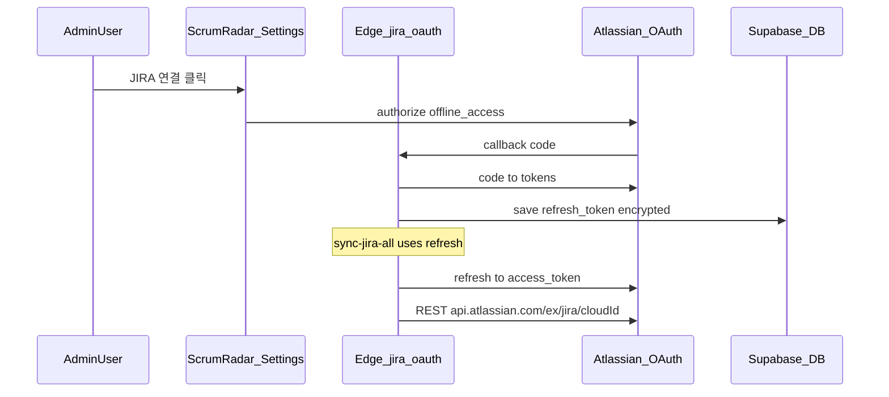

# JIRA OAuth 2.0 (3LO) — 중기 설계 스파이크

현재는 **서비스 계정 API 토큰 + Supabase Edge** 로 운영합니다 ([JIRA_AUTH.md](JIRA_AUTH.md)).  
OAuth는 **수동 토큰 재발급을 더 줄이고 싶을 때** 검토하는 옵션입니다.

## OAuth vs API 토큰

| | API 토큰 (현재) | OAuth 2.0 3LO |
|--|----------------|----------------|
| 최초 설정 | Edge Secret에 붙여넣기 | Atlassian 앱 등록 + 1회 관리자 로그인 |
| 일상 갱신 | 만료 전 수동 재발급 (최대 1년) | refresh token으로 access token 자동 갱신 |
| 미사용 시 | 만료일까지 유효 | refresh **90일 미사용** 시 재로그인 필요 |
| 구현 | 완료 | 미구현 |

## 아키텍처 초안

## 구현 시 주요 작업

1. **Atlassian Developer Console** — OAuth 2.0 (3LO) 앱, callback URL
2. **테이블** `jira_oauth_tokens` — `refresh_token`, `access_token`, `expires_at`, `cloud_id` (RLS: service role only)
3. **Edge Functions**
   - `jira-oauth-start` / `jira-oauth-callback` — 최초·재연결
   - `_shared/jira-oauth.ts` — refresh 회전 시 **새 refresh_token DB 저장** 필수
4. **REST base URL** — scoped token은 `https://api.atlassian.com/ex/jira/{cloudId}/...` ([Atlassian docs](https://developer.atlassian.com/cloud/jira/platform/oauth-2-3lo-apps/))
5. **설정 UI** — 연결 상태·재연결 버튼

## 리스크

- refresh 회전 버그 시 전체 동기화 중단
- cloudId API와 기존 `site.atlassian.net/rest` URL 경로 차이 → mapper·테스트 전면 점검
- 보안: refresh_token 암호화·감사 로그

## 권장

1단계(서버 단일 API 토큰)로 운영 안정화 후, OAuth 필요성이 확인되면 이 문서를 기준으로 이슈/마일스톤을 잡습니다.
